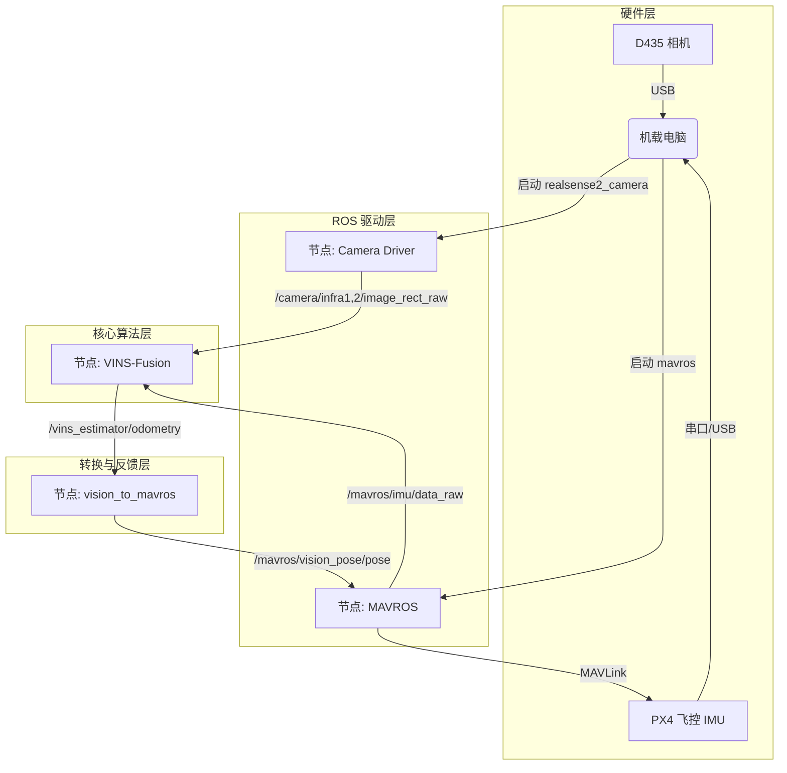

## 无人机自主定位

这篇文档旨在为你建立一个关于**无人机自主定位技术**的完整知识体系。既然你已经接触了实机和仿真，理解这些概念将帮助你打通从硬件到算法再到飞控的整个链路。

---

### 第一部分：为什么飞控需要位置信息？

在无人机控制理论中，控制回路分为**内环**和**外环**：

1.  **内环（姿态/角速度环）：**
    *   **输入：** 遥控器的杆量（比如“向右倾斜 10 度”）。
    *   **传感器：** 依靠飞控内部的 **IMU**（陀螺仪和加速度计）。
    *   **作用：** 保持飞机平稳，不翻车。
    *   **模式：** Stabilized（自稳）、Acro（特技）。
    *   **缺陷：** 飞机不知道自己在哪，风一吹就飘走了。飞控只管“平不平”，不管“在不在原点”。

2.  **外环（位置/速度环）：**
    *   **输入：** 期望坐标（比如“去 x=0, y=0, z=2”）。
    *   **传感器：** **必须有外部定位源**（GPS、视觉里程计、激光雷达等）。
    *   **作用：** 抵抗风的干扰，实现悬停、航点飞行、轨迹跟踪。
    *   **模式：** Position（定点）、Offboard（外部控制）、Mission（航点）。

**结论：** 如果没有位置信息，飞控就是个“瞎子”，只能凭感觉保持平衡，无法执行“去哪里”的命令。

---

### 第二部分：核心技术分类详解

目前为飞控提供位置信息的技术主要分为三大类：**全球定位系统**、**相对里程计**、**外部参考系统**。

#### 1. 全球定位系统 (GNSS)
这是室外最常用的技术。
*   **输入：** 卫星信号（GPS, 北斗, Galileo, GLONASS）。
*   **输出：** 经度、纬度、海拔高度（绝对坐标）。
*   **特点：** 全球通用，无累积误差；但在室内、桥下、高楼旁无法使用。

#### 2. 里程计 (Odometry) —— 室内/拒止环境的核心
“里程计”这个词源于希腊语，意思是“测量路程”。它的核心逻辑是**航位推算 (Dead Reckoning)**：通过分析**连续时间内的运动变化**来推算当前位置。

它包含以下几个重要子类：

*   **A. 视觉里程计 (Visual Odometry, VO)**
    *   **原理：** 纯靠摄像头。通过对比两帧图像中的特征点（比如桌角的像素移动了多少），算出相机的运动。
    *   **问题：** 单目 VO 无法知道尺度（不知道移动了 1 米还是 1 厘米，这就是“尺度模糊”）。双目 VO 可以解决尺度问题。

*   **B. 视觉惯性里程计 (Visual-Inertial Odometry, VIO) —— *目前最主流***
    *   **原理：** **摄像头 (Visual) + IMU (Inertial)**。
    *   **优势：**
        *   IMU 频率高（200Hz+），反应快，能提供绝对尺度（加速度积分）。
        *   视觉 频率低（30Hz），但能修正 IMU 的漂移。
        *   **互补：** 猛烈运动信 IMU，缓慢运动信视觉。
    *   **典型硬件：** Intel RealSense D435i, OAK-D, 相机+外置IMU。

*   **C. 激光里程计 (LiDAR Odometry, LO / LIO)**
    *   **原理：** 使用激光雷达扫描周围环境的轮廓（点云），通过点云匹配（ICP/NDT）计算位移。LIO 则是加入了 IMU。
    *   **优势：** 精度极高，不受光照影响（全黑也能飞），适合大范围建图。
    *   **劣势：** 设备重、贵、算力消耗大。

*   **D. 光流 (Optical Flow)**
    *   **原理：** 类似光电鼠标。只看地面的纹理移动速度。
    *   **区别：** 严格来说它通常只提供**速度 (Velocity)** 而非 **位置 (Position)**。虽然积分能得位置，但误差累积极快。通常用于定点悬停（Flow Hold），很难用于长距离导航。

#### 3. 外部参考系统 (External Reference)
*   **动作捕捉系统 (MoCap):** 也就是 Vicon / OptiTrack。在房间里装一圈昂贵的摄像机，贴反光点。这是**上帝视角**，精度最高（毫米级），但只能在实验室内用。
*   **UWB (超宽带):** 类似室内的 GPS 基站。

---

### 第三部分：流行算法与技术栈

这里列出目前开源界最能打的几个算法，你在论文中经常会看到它们。

| 类别    | 算法名称        | 特点                                                         | 适用硬件                 |
| :------ | :-------------- | :----------------------------------------------------------- | :----------------------- |
| **VIO** | **VINS-Fusion** | **目前最强**。香港科大开源。支持单目/双目 + IMU。鲁棒性极高，有回环检测（消除累积误差）。 | RealSense, OAK, 工业相机 |
| **VIO** | **OpenVINS**    | 美国特拉华大学开源。理论严谨，计算效率极高，资源占用比 VINS 低。 | 同上                     |
| **VIO** | **ORB-SLAM3**   | 也是神作。基于特征点，建图效果好，支持多种模式。但跑在无人机上对算力要求稍高。 | 同上                     |
| **LIO** | **LIO-SAM**     | 激光雷达 SLAM 的代表作。紧耦合 IMU，适合室外或大厂房。       | VLP-16, Livox 等雷达     |
| **LIO** | **FAST-LIO2**   | 港大开源。速度极快，甚至能在无人机机载电脑上跑得飞快。       | 各种激光雷达             |

---

### 第四部分：实际使用指南 (Pipeline)

这是你最关心的部分：**如何把这些东西串起来喂给飞控？**

#### 1. 数据流向
`传感器 (D435)` -> `机载电脑 (运行 VINS算法)` -> `ROS 里程计话题` -> `坐标转换节点` -> `MAVROS` -> `PX4 (EKF2 融合)`

#### 2. 输入与输出 (以 VINS-Fusion 为例)

*   **输入 (Input to Algorithm):**
    *   图像话题：`/camera/infra1/image_rect_raw` (双目左)
    *   图像话题：`/camera/infra2/image_rect_raw` (双目右)
    *   IMU话题（可选）：`/camera/imu` 或 `/mavros/imu/data_raw`

*   **算法输出 (Output from Algorithm):**
    *   **类型：** `nav_msgs/Odometry`
    *   **内容：** 包含位置 (x, y, z) 和 姿态 (四元数 qx, qy, qz, qw)。
    *   **频率：** 通常 20Hz - 30Hz（纯视觉）或 IMU 频率（VIO）。

#### 3. 关键中间人：MAVROS 话题

PX4 飞控通过 MAVROS 接收位置信息，主要有以下两个接口（**二选一**，不可同时混用）：

*   **接口 A: 视觉位置/里程计 (最常用)**
    *   **话题：** **`/mavros/vision_pose/pose`** (发 PoseStamped) 或 **`/mavros/odometry/out`** (发 Odometry)
    *   **适用：** VINS, ORB-SLAM, T265 等。
    *   **PX4 参数：** 需设置 `EKF2_AID_MASK` 或 `EKF2_EV_CTRL` 启用视觉融合。

*   **接口 B: 动作捕捉/上帝视角**
    *   **话题：** **`/mavros/mocap/pose`**
    *   **适用：** Vicon, OptiTrack, Gazebo 真值。
    *   **特点：** 飞控会认为这是绝对精准的，信任度极高。

#### 4. 必须注意的坑：坐标系转换 (TF)

这是新手挂得最多的地方。
*   **VINS 输出：** 通常是 **Camera Frame** (前左上) 或自定义的世界坐标系。
*   **ROS 标准：** **ENU** (East-North-Up，东-北-天)。
*   **PX4 飞控标准：** **NED** (North-East-Down，北-东-地)。

**解决方案：**
你需要运行一个转换节点（如 `vision_to_mavros`），它做两件事：
1.  把 VINS 的坐标轴旋转，对齐到 ENU。
2.  MAVROS 插件会自动把 ROS 的 ENU 转换为飞控需要的 NED。
3.  **验证标准：** 推飞机向前，MAVROS 里的 X 增加；向左推，Y 增加；向上推，Z 增加。

---

### 总结

你的 **D435 + 机载电脑** 方案属于 **里程计 (Odometry) -> 视觉 (Visual) / VIO** 这一分支。

*   **现在你在做：** D435 (纯视觉) -> VINS-Fusion -> Odometry。
*   **未来升级：** D435i (VIO) -> VINS-Fusion (Stereo+IMU) -> 更鲁棒的 Odometry。
*   **最终目的：** 产生一个欺骗信号，让飞控以为自己在室内收到了精准的 GPS，从而允许你进行 Offboard 控制。