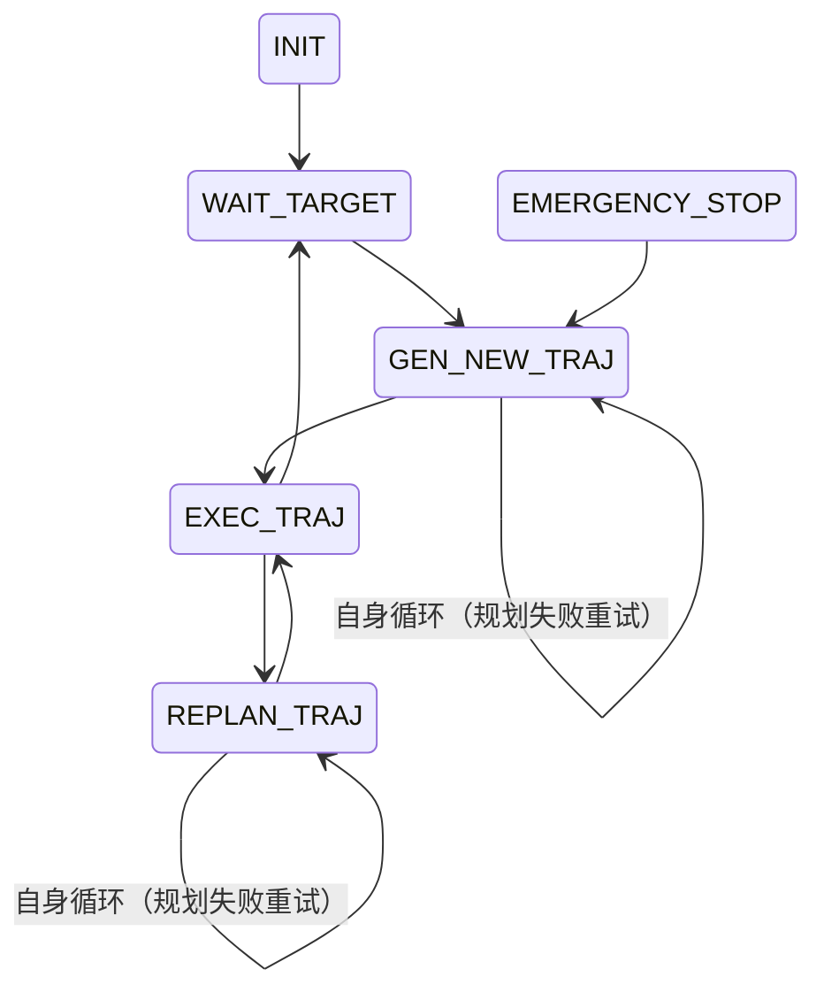

### 前言
参考[Notebooks/EGO-planner及其v2的学习及代码阅读.md at main · Littlestarluo/Notebooks](https://github.com/Littlestarluo/Notebooks/blob/main/EGO-planner%E5%8F%8A%E5%85%B6v2%E7%9A%84%E5%AD%A6%E4%B9%A0%E5%8F%8A%E4%BB%A3%E7%A0%81%E9%98%85%E8%AF%BB.md)
整个EGO-Planner的代码内容并不小，想要读懂所有部分耗时很多，在阅读时一定要抓住一个主线，了解到每一部分是在做什么

---
### 文件结构
![[ego 代码文件结构.png]]
planner为规划器相关功能包，而uav_simulator为在模拟时的仿真环境相关功能包。planner下可分为以下部分
- bspline为优化函数相关
- path_searching为A* 相关
- plan_env为建立栅格图和膨胀图
- plan_manage为整个项目的入口（其下src中有一个ego_planner_node文件，其中有main函数）
- traj为轨迹相关代码

使用plan manage的launch文件中的run in sim启动文件，会调用advanced param.xml文件中的高级参数设置

---
### 建图 plan_env
![[ego-planner代码plan_env结构.png]]
grid_map.cpp完成了建图功能，程序主体就是地图初始化函数`void GridMap::initMap(ros::NodeHandle &nh)`，程序的其余部分就是initMap中各个发布器、订阅器的回调函数，最后是这些回调函数中使用的功能函数，形成非常清晰的三级结构。

> ROS工程的文件结构有许多使用技巧，可以从此一窥

发现`class grid_map`在`grid_map.h`中被声明，而在`grid_map.cpp`中声明了其`init`函数。首先，为了编译方便与再次调用等原因，在ROS工程中的一个节点的使用往往遵循**分离主义**，具体情况如下。
- 首先类的主体声明写在.h文件并放置于`ws/src/ros_pkg/include/`下
```cpp
//include/grid_map.h内
class GridMap {
	public:
		parameters;
}
```
- 其入口例如`class_name::init`则写为.cpp文件放在`ws/src/ros_pkg/src`下，而在入口函数中会调用的其他函数也写在该.cpp文件中
```cpp
//src/gird_map.cpp内
# include "plan_env/gird_map.h"
void GridMap::initMap(ros::NodeHandle &nh){
	node_ = nh;
}
```
- 在项目整体的入口文件c.pp的`main`函数中会调用类的入口
```cpp
//在plan.cpp内
# include <ros/ros.h>
# include "plan_env/grid_map.h"
GridMap::Ptr grid_map_test_;
int main(int argc, char** argv)
{
	ros::init(arc, argv, "gridmap_test_node");
	ros::NodeHandle nh_("~");
	gird_map_test_->initMap(nh_);
	ros::spin();
	return 0;
}
```
- 最后通过`launch`文件启动项目入口cpp文件

其次，关于**类的智能指针**的使用见下文

最后，关于`CMakeList`中需要做出修改，例如plan_env功能包中并没有可以直接运行的文件，而都是作为库文件存在，需要修改该功能包的CMake代码。首先需要将两个cpp文件编译为一个动态链接库.so文件，但此时该文件也只是在`plan_env`的编译目录中
```Cmake
add_library( plan_env 
    src/grid_map.cpp 
    src/raycast.cpp
)
```
而为了让其他功能包也使用这个库，需要向系统“注册”（通常在上述代码之前）
```Cmake
catkin_package(
  INCLUDE_DIRS include       # 告诉别人：我的头文件在这里（菜单在这里）
  LIBRARIES plan_env         # 告诉别人：我的二进制库是这个（菜在这里）
  CATKIN_DEPENDS roscpp ...  # 告诉别人：用我也得装这些依赖
)
```
它告诉 ROS 系统：“我生产了一个叫 plan_env 的库，头文件在 include 文件夹，库文件叫 plan_env。谁想用我，就按这个信息来找。”

而在其他功能包中，如果想要使用`plan_env`库，需要对`CMakeList`进行修改。首先是查找，找到`plan_env`注册的信息，然后将其头文件路径加入到`${catkin_INCLUDE_DIRS}` 变量中，然后把 `libplan_env.so` 的路径加入到 `${catkin_LIBRARIES}` 变量中
```cmake
find_package(catkin REQUIRED COMPONENTS
  roscpp
  plan_env    # <--- 关键！去ROS系统里找这个包
)
```
然后是包含头文件
```cmake
include_directories(
  ${catkin_INCLUDE_DIRS} 
)
```
最后是链接库
```cmake
add_executable(ego_planner_node src/plan.cpp ...)

target_link_libraries(ego_planner_node
  ${catkin_LIBRARIES}  # <--- 关键！
)
```
最终，还需要在调用者的`package.xml`中添加声明
```xml
<build_depend>plan_env</build_depend>
<exec_depend>plan_env</exec_depend>
<!-- 或者直接用 <depend>plan_env</depend> -->
```

>现在回到该功能包本身的内容上来


---
### plan_manage
run in sim.launch逻辑，运行 advanced param.xml（只要看开头与结尾是launch标签，那么xml文件就可以作为launch文件运行；这样写是为了层级化和结构化），运行ego planner节点，运行simulator仿真器。
——>关键在于第二步ego planner节点。查看cmake文件可以知道，ego planner节点是由三个文件拼接而成
![[ego planner node拼接.png]]
其中，ego planner node cpp中包含了main函数，为整体入口
``` cpp
using namespace ego_planner;

int main(int argc, char **argv)

{
  ros::init(argc, argv, "ego_planner_node");
  ros::NodeHandle nh("~");

  EGOReplanFSM rebo_replan;
  
  rebo_replan.init(nh);

  ros::Duration(1.0).sleep();
  ros::spin();
  
  return 0;
}
```
在main中，首先初始化了一个节点，然后声明了一个`EGOReplanFSM`类实体（FSM表示finite state machine有限状态机），然后运行其初始化函数。发现该类是一个在自定义库文件`ego_replan_fsm.h`中的类，但是其`init`函数则是在`ego_replan_fsm.cpp`中定义，于是查看`init`的内容。
发现首先是设定了句柄的参数，其次初始化了一些模组，最后设置了回调函数，于是在去寻找设定的模组与回调，首先是模组。
其中`visualization_`来自tra_utils包，执行可视化操作，而`planner_manager_`自然来自planner_manager.cpp，句柄nh传递到两个模块中，同时`visualization_`也和句柄传递到`planner_manager_`内，再加上状态机本身，可以看到携带句柄的节点有三个了。

其实`traj_server`是一个单独的.cpp，它的内部也有一个主函数，负责订阅轨迹和时间信息，再发布控制指令。因此，可以说实质上规划功能是两个部分组成的：状态机和轨迹服务器。

```cpp
    /* initialize main modules */
    visualization_.reset(new PlanningVisualization(nh));
    planner_manager_.reset(new EGOPlannerManager);
    planner_manager_->initPlanModules(nh, visualization_);
```
去寻找其最初被声明的位置，发现是在类的私有元素中。
```cpp
    /* planning utils */
    EGOPlannerManager::Ptr planner_manager_;
    PlanningVisualization::Ptr visualization_;
    ego_planner::DataDisp data_disp_;
```
听起来很绕，先解析一下语法，理清楚关键字的作用，文件的结构，起作用的顺序，以`planner_manager_`为例。

>ROS工程规范：分离化

首先是扩起来的作用域 `namespace ego_planner`，增加一个变量的作用域，防止变量重名，即如果在不同的作用域下要使用`EGOPlannerManager`类，则需要使用完整名`ego_planner::EGOPlannerManager`，而在`fsm.h`中也使用了同样的作用域，则不必使用完整名。
其次，和类名同名的函数表示构造函数与析构函数（与python的init函数区分，这里的init函数是一个自己定义的函数）。
第三，在`EGOPlannerManager`类成员中写了两次public，语法上是没有问题，只是不太规范。
```cpp
class EGOPlannerManager{
  public:
    typedef unique_ptr<EGOPlannerManager> Ptr;
}
```
第四，关于Ptr的使用，在`EGOPlannerManager`类中有这样的定义`typedef unique_ptr<EGOPlannerManager> Ptr;`，首先要清楚这是定义了一个类型的别名，即这是一个类型成员而不是对象成员，而在cpp中对于类型成员使用`ClassName::Type`来进行访问（类型成员和函数则用点进行分隔）。其次，什么是`unique_ptr`？这是cpp11中引入的智能指针（区别于裸指针），可以自动删除指向的对象（而不必手动delete），其次同一时间只会有一个指针指向被管理的对象，其作用基本与裸指针相同。此处相当于定义了一个指向类自身的指针类型。
第五，关于`reset`的使用。首先`reset`是智能指针的成员函数，使用方式如`p.reset(q) //q为智能指针要指向的新对象`，其实此处就是为指针分配空间。于是梳理一下整个流程：`main`函数声明了一个`FSM`类的实例，该类中有两个指向成员类的指针，调用`init`函数为这两个成员类分配空间

**为什么如此设计？**
为什么要绕一大圈用指针来表示类成员呢？而不是作为直接类成员？有以下几点原因。
首先是控制初始化时机，使用指针之后可以控制类成员的初始化时间，例如设计在ros节点句柄nh准备好之后。
其次是可扩展性，使用指针那么之后只需要更改类中的内容而不必更改变量名。

最终可以梳理得到`EGOReplanFSM::init`函数的作用：① 声明变量，获取参数；② 初始化主模块；③ 设置定时器循环；④ 设置发布者与接收者；


---
#### 主循环-状态机回调execFSMCallback()
在`init`函数中通过定时器开启主循环

>ROS中的定时器使用

`nh.createTimer`的作用。和之前基础内容中的循环类似，之前是用rate和while中的sleep来控制循环的时间，定时器也是用于循环，但是是一种更安全的循环
```cpp
ros::Rate r(10); // 10 hz
while (ros::ok())
{
  ... do some work ...
  r.sleep();
}
```
首先定时器的定义方式如下
```cpp
ros::Timer timer = nh.createTimer(ros::Duration(0.1), timerCallback);
```
而官方代码中的形式为
```cpp
 exec_timer_ = nh.createTimer(ros::Duration(0.01), &EGOReplanFSM::execFSMCallback, this);
```
其中回调函数的部分有些不同，这里使用的是一个成员函数指针，而this则代表使用当前实例的函数。Q：如果实际执行时间超出设定的间隔会怎样？A：只会错过运行周期，接着继续运行但是不会崩溃.
而对于回调函数的形式基本固定如下
```cpp
void EGOReplanFSM::execFSMCallback(const ros::TimerEvent &e)
{
	...
}
```
其参数内容为固定写法，e包含上一次与这一次回调函数应该和实际发生的时间
Q：两个timer之间的关系如何？A：回调函数相当于向队列中加入了一个任务，然后由main中的spin逐个取出然后执行；两个timer会共享一个任务队列，同样由spin逐个执行，相当于串行执行。


`execFSMCallback()`是整个规划过程的状态机，每过若干循环发布一次状态；每一次执行`exec_timer`，会根据当前的状态（一个枚举类型变量）进行切换行为，相当于一个有限状态机。
```cpp
switch (fsm_state_)
{
    case INIT:
        // 初始化状态
        changeFSMExecState();
        break;
    case WAIT_TARGET:
        // 等待目标
        changeFSMExecState();
        break;
    case GEN_NEW_TRAJ:
        // 生成新轨迹
        changeFSMExecState();
        break;
    case REPLAN_TRAJ:
        // 重新规划轨迹
        changeFSMExecState();
        break;
    case EXEC_TRAJ:
        // 执行轨迹
        changeFSMExecState();
        break;
    case EMERGENCY_STOP:
	    // 紧急停止
	    changeFSMExecState();
}
```

前两个状态`INIT`，`WAIT_TARGET`是纯粹的时序状态，单纯根据标识来等待和执行状态切换，而`GEN_NEW_TRAJ`，`REPLAN_TRAJ`和`EXEC_TRAJ`则是具体的规划状态，对应生成、重规划和执行轨迹；


 **关键逻辑解析**
1. **启动流程**：
    - INIT -> WAIT_TARGET: 系统启动，等待里程计数据和触发信号。
    - WAIT_TARGET -> GEN_NEW_TRAJ: 收到目标点，生成第一条轨迹。
        
2. **核心飞行循环 (The Loop)**：
    - **EXEC_TRAJ (执行)**: 这是无人机正常飞行时的状态，不断检查进度。
    - **重规划判定**:
        - 如果离起点太近（刚出发）或者离终点太近（快到了），为了防止轨迹抖动或不必要的计算，**不进行重规划**，保持 EXEC_TRAJ。
        - 如果处于中间段，代码进入 else 分支，状态切换到 REPLAN_TRAJ。
    - **REPLAN_TRAJ (重规划)**: 在这里调用 planFromCurrentTraj()。如果成功，马上切回 EXEC_TRAJ 继续飞；如果失败，保持在当前状态下一轮继续试。
        
3. **异常与结束**：
    - **结束**: 在 EXEC_TRAJ 中，如果时间超过了轨迹总时长 (duration)，说明到达目的地，切回 WAIT_TARGET 等待下一个指令。
    - **急停复位**: 如果进入 EMERGENCY_STOP（通常由外部碰撞检测触发），无人机会刹车。只有当速度降到几乎为 0 (< 0.1) 时，才会切回 GEN_NEW_TRAJ 尝试重新生成轨迹恢复飞行。

至此，状态机可以归纳为一个2+3+1的结构，其主体为`EXEC_TRAJ`

---
##### GEN_NEW_TRAJ
刚启动时和急停之后，规划初始路线
```cpp
    case GEN_NEW_TRAJ:
    {
	  ...

      bool flag_random_poly_init;
      if (timesOfConsecutiveStateCalls().first == 1)
        flag_random_poly_init = false;
      else
        flag_random_poly_init = true;

      bool success = callReboundReplan(true, flag_random_poly_init);
      if (success)
      {
        changeFSMExecState(EXEC_TRAJ, "FSM");
        flag_escape_emergency_ = true;
      }
      else
      {
        changeFSMExecState(GEN_NEW_TRAJ, "FSM");
      }
      break;
    }
```
可见其中关键的部分是`timesOfConsecutiveStateCalls`和`callReboundReplan`。首先查看`timesOfConsecutiveStateCalls`
```cpp
  std::pair<int, EGOReplanFSM::FSM_EXEC_STATE> EGOReplanFSM::timesOfConsecutiveStateCalls()
  {
    return std::pair<int, FSM_EXEC_STATE>(continously_called_times_, exec_state_);
  }
```
发现该函数作用是一次性返回当前状态和在这个状态中循环了多少次

>std::pair的作用

cpp标准库中的一个容器，将两个不同类型的数据打包成一个对象，固定只有两个成员变量，固定名称为`first`和`second`。尖括号的作用是 模板 语法，指定pair中元素的类型

再看`callReboundReplan`，发现调用了`planner_manager_->reboundReplan`，且要求传入起点坐标和速度、终点坐标和速度等参数，看起是关键部分，共有近200行内容。

**reboundReplan**
首先该函数可以拆分为四部分：准备阶段，生成轨迹，核心优化，时间重分配
```cpp
bool EGOPlannerManager::reboundReplan()
{
	/*STEP 0: pre-check*/
	打印日志;
	检查终点，如果太近就不规划;
	计算B样条时间步长;
	/*STEP 1: INIT*/
	生成一串初始点，作为B样条初值;
	策略A：从零规划;
	策略B：基于当前轨迹规划;
	将串点转换为B样条控制点;
	/*STEP 2: OPTIMIZE*/
	进行梯度优化，实现避障;
	/*STEP 3: REFINEMENT*/
	检查物理可行性;
}
```

然后对`INIT`部分进行分析，这里有一些不理解的地方：1是为什么一开始是用多项式去寻找路径 2是这个多项式路径是如何规划的，是否会考虑障碍物 3是采样点为什么不能直接是控制点 4是何时会启动A* 。
在阅读代码之后发现，冷启动（策略A）的部分使用`/planner/traj_utils/src/polynomial_traj.cpp`所生成的轨迹都是不考虑障碍物，仅满足起点与终点约束的多项式曲线。这是一个乐观的策略，即EGO假设在许多空旷场景下直接飞过去没问题。那障碍物与A* 在哪里体现？——在整个`INIT`的最后，热启动也结束之后。将多项式轨迹点转换为控制点，此时有如下代码：
```cpp
vector<vector<Eigen::Vector3d>> a_star_pathes;
a_star_pathes = bspline_optimizer_rebound_->initControlPoints(ctrl_pts, true);
```
查看来自`/planner/bspline_opt/src/bspline_optimzier.cpp`的`bspline_optimizer_rebound::initcontrolpoint`，发现也有近200行内容，大概也是关键代码，阅读后发现是论文中关键部分，{p, v} pairs的具体实现。于是想到，此处只是生成新轨迹的代码，那么下面的`REPLAN_TRAJ`部分是否也有相同的代码呢？查看后发现确实也使用了`reboundReplan`，可见这部分的确是关键代码。

而`initcontrolpoints`也可以拆分为以下几个步骤：
```cpp
std::vector<std::vector<Eigen::Vector3d>> BsplineOptimizer::initControlPoints()
{
	/*1.找出碰撞的路段*/
	/*2.生成引导路径A**/
	/*3.确定受影响的控制点范围*/
	/*4.生成pv对*/
}
```

##### REPLAN_TRAJ


##### EXEC_TRAJ


---
#### 副循环-检碰回调checkCollisionCallback()


---
### 代码相关问题 
**Eigen库**
cpp中的线性代数库，使用该库可以完成例如矩阵乘法等运算。其中根据头文件不同，其导入方式也不一致。
```cpp
- #include <Eigen/Core> //只引入最基础的矩阵和数组功能（编译快）。
- #include <Eigen/Dense> //引入所有稠密矩阵运算（最常用）。
- #include <Eigen/Eigen> //引入所有模块（包括稀疏矩阵 Sparse、几何模块 Geometry 等）。
```
因为此处用了许多高级功能，故直接导入所有模块。而编译器默认是找不到 `<Eigen/Eigen>` 在哪里的，因为它通常安装在 `/usr/include/eigen3` 这种非标准路径下。需要告诉 CMake 去哪里找。通常在camkelist中有如下部分
```cmake
# 1. 查找 Eigen 库包
find_package(Eigen3 REQUIRED)

# 2. 将 Eigen 的头文件路径加入到编译器的搜索路径中
# 这步之后，编译器才能看懂 <Eigen/Eigen> 到底在硬盘的哪个位置
include_directories(
    ${EIGEN3_INCLUDE_DIRS}
)

# 3. 编译节点 (回顾刚才学的)
add_executable(ego_planner_node src/ego_planner_node.cpp)

# 4. 链接库
# 注意：Eigen 是 "Header-only" (纯头文件) 库！
# 它通常不需要 target_link_libraries 链接 .so 文件，
# 只要 include 了头文件，代码其实就已经包含进去了。
# (不过为了保险或某些特定模块，有时也会写在链接里，或者只链接 catkin_LIBRARIES)
```


